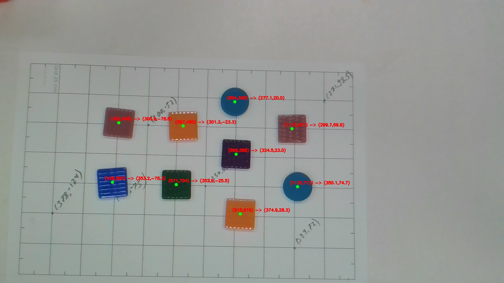
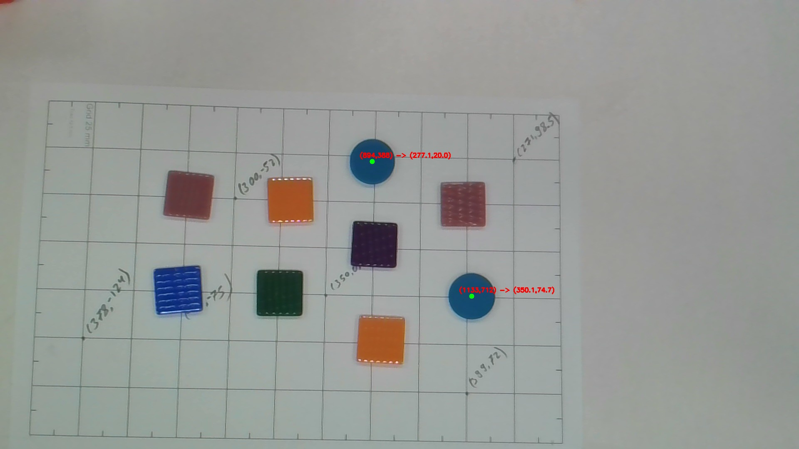
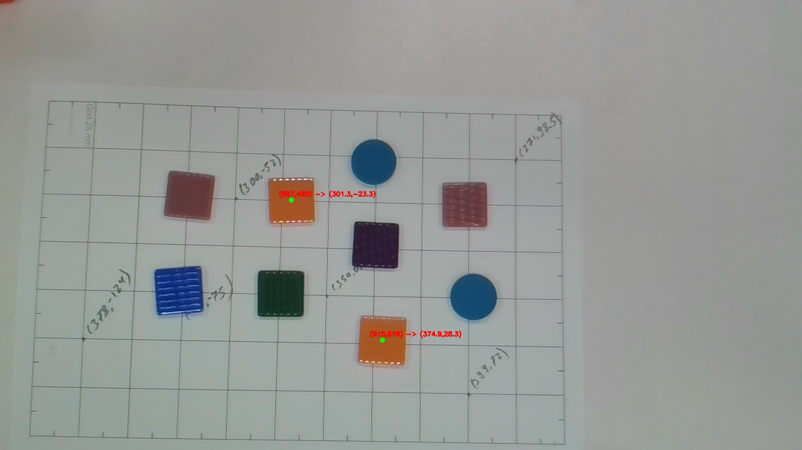
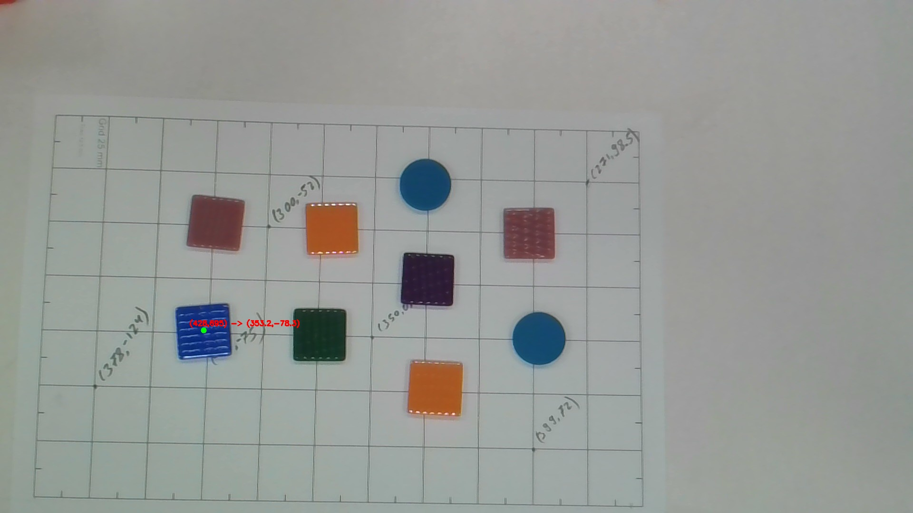
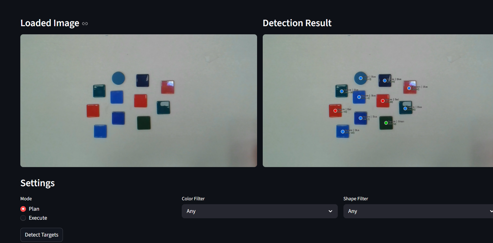
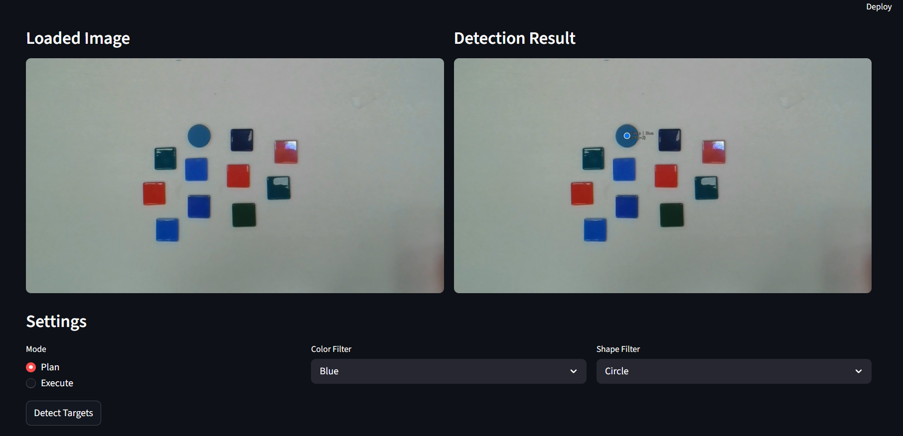

# Machine Vision Final Project
## IMAGE-AND-SHAPE-DETECTABLE-PICK-AND-PLACE

### Course
Machine Vision  
HAMK – Häme University of Applied Sciences  

### Team Members
- Diwas Kharel
- Bikash Basyal
- Biswash Pokhrel

---

# 1. Project Overview

This project implements a **vision-guided robotic pick-and-place system** where a camera detects objects on a table and guides a **Dobot MG400 robot** to pick them and place them into a box.

The project integrates the building blocks developed during the Machine Vision course including:

- Image preprocessing
- Image segmentation
- Coordinate mapping
- Object detection
- Color and shape selection
- robot arm pick and place

The system converts object locations detected in the camera image into **robot workspace coordinates** and performs automated pick-and-place operations.

---

# 2. Project Goal

The goal of this project is to build a system capable of:

- Calibrating a real camera with the robot workspace
- Detecting objects and distingues its properties i.e color and shape from a camera image 
- Converting pixel coordinates (u, v) to robot coordinates (X, Y)
- Providing two system modes:
  - **Plan Mode**
  - **Execute Mode**

### Plan Mode
The system detects objects and computes robot coordinates without moving the robot.

### Execute Mode
The system performs the full robot pick-and-place operation.

---

# 3. System Architecture

The project is structured into modular components.
IMAGE-AND-SHAPE-DETECTABLE-PICK-AND-PLACE
### Project Structure

```
calibration/
perception/
utils/
output/

calibration.json
dobot_api.py
dobot_controller.py
app_ui.py
main.py
inputimage.jpy
```


---

# 4. Calibration System

The calibration tool maps image coordinates to robot workspace coordinates.

The calibration process involves collecting at least **four-eight corresponding points**:

Pixel coordinates (u, v) : a click funtion to give pixel cordinate of each click 

```
click.py
```

Robot coordinates 
(X, Y) : using dobots studio and dobot arm

Using these correspondences, the system computes a **homography matrix (H)** that transforms coordinates from image space to robot workspace.

The calibration information is saved in a file:
```
calibration.json
```


---
# 5.Image Detection And Preprocessing

## a. Image Preprocessing

Converts the image to **HSV** (for color detection) and **grayscale** (for segmentation). **Otsu thresholding** automatically binarizes the image, and **morphological operations** clean up noise and fill gaps.

**Result:** A binary image — objects in **white**, background in **black**.

---

## b. Object Segmentation

**Connected Components Analysis** labels each white region as a separate object. Small and oversized regions are filtered out, and each valid object's **bounding box**, **center point**, and **mask** are extracted.

**Result:** A list of candidate objects with location and size.

---

## c. Shape Detection

The object's **contour** is extracted and two features are computed:

- **Circularity** — high value → **Circle**
- **Polygon approximation** — 4 vertices → **Square** (aspect ratio ≈ 1) or **Rectangle**

**Result:** Each object gets a **shape label**.

---

## d. Color Detection

Object pixels are isolated using the **mask**, and the average **Hue** from the HSV image is mapped to a color: **Red, Orange, Green, or Blue**.

**Result:** Each object gets a **color label**.

---
## Example
### Any and all object and color detetion

detects all the shapes with everyclor present
`python main.py detect --mode plan`
### Color Detection



**BlueandCircle.jpg** — Detects and highlights blue objects in the scene.
`python main.py detect --color blue --mode plan`


**OrangeObjet.jpg** — Detects and highlights orange objects in the scene.
`python main.py detect --color orange --mode plan`

---

### Shape Detection


**Circle.jpg** — Detects circular shapes
`python main.py detect --shape circle  --mode plan`


### Combined filteration

**BlueandCircle.jpg** — Blue color filter for only square
`python main.py detect --shape Square --color Blue --mode plan`

# 6. Graphical User Interface (GUI)

A graphical interface was implemented using **Streamlit** to allow an operator to interact with the system.

The GUI provides:

- Live or captured camera image
- Mode selection (Plan / Execute)
- Color selection
- Shape selection
- Buttons for detection and robot execution

The interface also displays detected objects and computed robot coordinates.

### GUI Screenshot




---


### Running the Project

Clone the repository

Run GUI
```
streamlit run app_streamlit.py
```

---

# 7. Discussion


This project demonstrates the integration of machine vision and robotics for automated object manipulation. The system successfully performs camera calibration, object detection (i.e., color and shape), coordinate transformation, and robotic pick-and-place operations.

### Observations

- The system works reliably in detecting objects under moderate lighting conditions, though it has difficulty detecting very bright colors such as yellow and white.  
- Color detection is moderately reliable; some colors may be confused when brightness, shine, or texture varies.  
- Testing was performed only on circles and squares, which gave 100% accurate results.  
- Pick-and-place operations succeed approximately 70–80% of the time. Failures are usually due to inaccuracies in detecting the true object center—sometimes the center is detected toward the edges, causing positioning errors.  
- The GUI improves usability for operators. 
### Our Expriene
- The project required around 30–40 hours to complete. Most time was spent on color and shape detection, and robot movement
- Significant effort was needed to fine-tune mean hue values for optimal color separation.  
- Robot control and movement were also challenging, particularly in setting up pick-and-place points, rest points, and movement paths. Some unnecessary movements and emergency stops occurred and where fixed.
-As we were new to developing GUI, that also became difficult part .

### Possible Improvements

- Enable a live camera feed for real-time operation.  
- Improve robustness to lighting variations.  
- Implement real-time object tracking.  
- Add support for picking and sorting multiple object types.  


---

# . Repository

Project Repository:

https://github.com/diwaskharel-afk/IMAGE-AND-SHAPE-DETECTABLE-PICK-AND-PLACE
